# AWS E-Commerce Application using Microservices Containerization  (ECS + S3 + RDS + DynamoDB)

## Project Overview

This project demonstrates a **production-style microservices architecture** deployed on AWS using containerization and managed cloud services.

The application simulates a real-world **e-commerce platform**, where users can:
- Browse products through a static frontend
- Add items to a shopping cart
- Place orders
- View order confirmation

---

## Why This Project Matters

As a Cloud Engineer, it is important to move beyond monolithic applications and understand how **scalable, distributed systems** are designed.

This project focuses on:

- Breaking down an application into **independent microservices**
- Deploying services using **Docker containers**
- Running containers on **Amazon ECS**
- Using **different databases for different workloads**
- Designing for **high availability across multiple Availability Zones**

---

## High-Level Architecture

The system is designed using a **microservices + cloud-native architecture**, where each component has a clearly defined responsibility.

Key architectural highlights:

- **Frontend (S3 Static Website)**
  - Hosts HTML, CSS, and JavaScript files
  - Provides a lightweight and cost-effective UI layer

- **Backend (ECS Microservices)**
  - Product Service → manages product data
  - Cart Service → handles user cart operations
  - Order Service → processes orders

- **Load Balancer (ALB)**
  - Distributes incoming traffic across services
  - Ensures scalability and fault tolerance

- **Databases**
  - Amazon RDS → structured data (Products & Orders)
  - DynamoDB → fast, scalable cart storage

- **Multi-AZ Deployment**
  - Services are deployed across multiple Availability Zones for high availability

---

## Learning Objectives

By working through this project, you will understand:

- How to design **microservices-based systems**
- How frontend and backend communicate via **REST APIs**
- How to containerize applications using **Docker**
- How AWS services integrate in a real-world architecture
- How to design systems for **scalability, fault tolerance, and performance**

---

## Architecture Diagram Explanation

To understand the system clearly, let’s break down the architecture step-by-step as shown below:

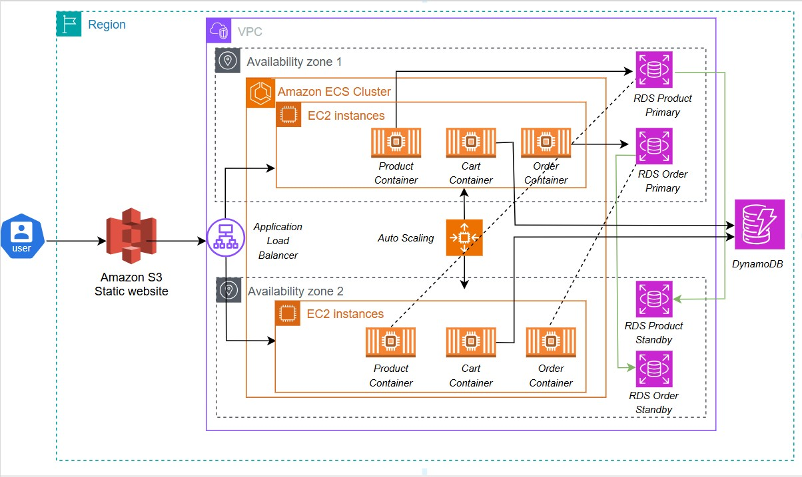

> Note: This diagram represents a **highly available microservices architecture** deployed on AWS using ECS, RDS, DynamoDB, and S3.

---

### 1. User Interaction Layer (Frontend)

- The user accesses the application through a **static website hosted on Amazon S3**
- S3 serves:
  - HTML
  - CSS
  - JavaScript
- This approach is:
  - Cost-effective
  - Highly scalable
  - Ideal for static frontend applications

---

### 2. Traffic Routing (Application Load Balancer)

- All incoming requests are routed through an **Application Load Balancer (ALB)**
- The ALB:
  - Distributes traffic across multiple services
  - Ensures no single instance is overloaded
  - Improves availability and fault tolerance

- It also uses **path-based routing**:
  - `/products` → Product Service
  - `/cart` → Cart Service
  - `/orders` → Order Service

---

### 3. Compute Layer (Amazon ECS with EC2)

- Backend services are deployed as **Docker containers** inside an **Amazon ECS Cluster**
- ECS runs on **EC2 instances** across multiple Availability Zones

- Each microservice runs independently:
  - Product Service
  - Cart Service
  - Order Service

---

### 4. High Availability (Multi-AZ Deployment)

- Services are deployed across:
  - Availability Zone 1
  - Availability Zone 2

This ensures:
- If one AZ fails → application still runs
- Improved fault tolerance
- Better uptime

---

### 5. Auto Scaling

- ECS services are configured with **Auto Scaling**
- This allows:
  - Automatic scaling up during high traffic
  - Scaling down during low usage

This ensures:
- Cost optimization
- Performance stability

---

### 6. Database Layer

Different databases are used based on workload, following the principle of **choosing the right database for the right use case**.

---

#### Amazon RDS (Relational Database)

- Used for:
  - Product Service
  - Order Service

- Stores:
  - Structured data (products, orders, relationships)

- In a production environment:
  - RDS is typically configured with:
    - Primary instance (Multi-AZ)
    - Standby replica for failover

- **Project Limitation (Free Tier Constraint)**:
  - In this project, only a **single RDS instance** is used
  - Multi-AZ standby deployment was not configured due to AWS Free Tier limitations

- **Understanding (Important)**:
  - Although not implemented here, I understand that:
    - Multi-AZ improves high availability
    - Automatic failover ensures minimal downtime
  - This would be the **recommended setup in a production environment**

---

#### Amazon DynamoDB (NoSQL Database)

- Used for:
  - Cart Service

- Reason for choosing DynamoDB:
  - Schema-less design
  - High-speed read/write operations
  - Scales automatically

- Ideal for:
  - Frequently changing data (like user carts)
  - Low-latency applications

---

### Why Two Databases?

This project demonstrates a **polyglot persistence approach**:

- RDS → for structured, relational data
- DynamoDB → for fast, flexible, key-value storage

This is a common design pattern in modern cloud architectures.

---

### 7. Data Flow Summary

1. User opens the S3-hosted frontend
2. Requests are sent to ALB
3. ALB routes requests to ECS services
4. Services process requests:
   - Product → RDS
   - Cart → DynamoDB
   - Order → RDS
5. Response is returned to the user

---

### Key Design Decisions

- **Microservices architecture** → independent scalability
- **S3 for frontend** → low cost and simplicity
- **ECS for backend** → container orchestration
- **RDS + DynamoDB** → right database for right use-case
- **Multi-AZ deployment** → high availability

---

## AWS Services Used

This project makes use of multiple AWS services to build a **scalable, fault-tolerant microservices architecture**.

Each service is chosen based on its strengths and role in the system.

---

### 1. Amazon S3 (Static Website Hosting)

- Used to host the frontend (HTML, CSS, JavaScript)
- Provides:
  - High availability
  - Low cost
  - Easy deployment for static websites

- The frontend is accessible directly via S3 static website endpoint

 **S3 Static Website Configuration**

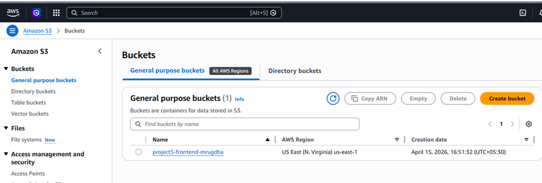

---

### 2. Amazon ECS (Elastic Container Service)

- Used to run backend microservices as Docker containers
- Services deployed:
  - Product Service
  - Cart Service
  - Order Service

- ECS handles:
  - Container orchestration
  - Service scaling
  - Task management

 **ECS Services Running**

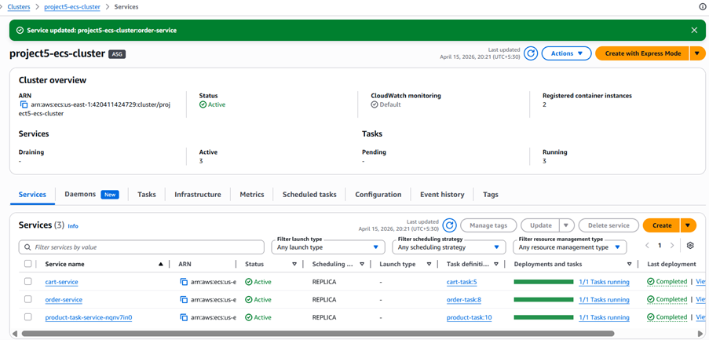

---

### 3. Amazon EC2 (Compute Layer for ECS)

- ECS is configured using **EC2 launch type**
- EC2 instances act as:
  - Underlying compute infrastructure
  - Hosts for Docker containers

- Instances are deployed across multiple Availability Zones

 **EC2 Instances**

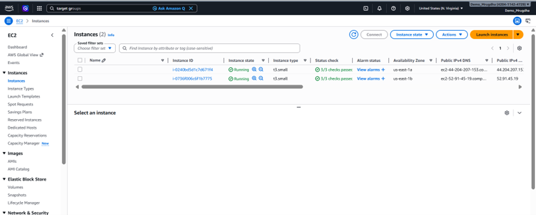

---

### 4. Application Load Balancer (ALB)

- Routes incoming traffic to appropriate ECS services
- Supports:
  - Path-based routing
  - Load distribution
  - High availability

 **ALB Routing Rules**

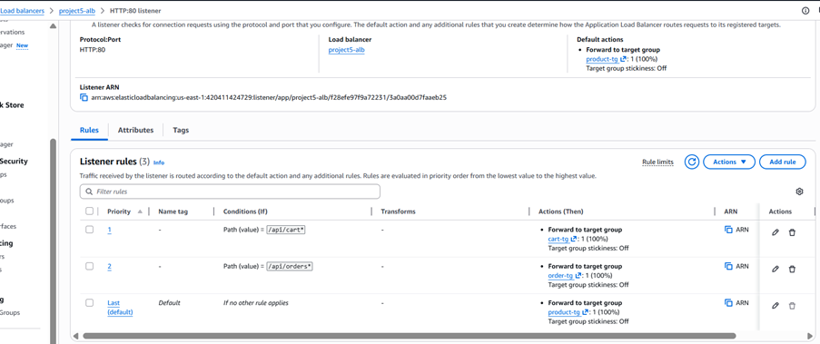

---

### 5. Amazon RDS (Relational Database)

- Used for:
  - Product data
  - Order data

- Provides:
  - Structured storage
  - SQL support

 **RDS Configuration**

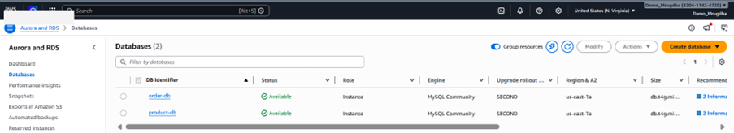

---

### 6. Amazon DynamoDB (NoSQL Database)

- Used for:
  - Cart Service

- Provides:
  - Fast performance
  - Flexible schema
  - Fully managed NoSQL database

 **DynamoDB Table**

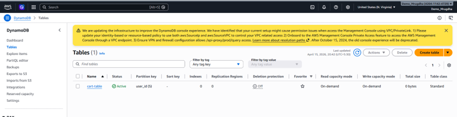

---

### 7. Amazon ECR (Elastic Container Registry)

- Used to store Docker images for:
  - Product Service
  - Cart Service
  - Order Service

- Allows ECS to pull container images securely

 **ECR Repositories**

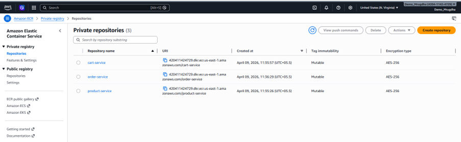

---

### 8. Auto Scaling Group (ASG)

- Automatically manages EC2 instances
- Ensures:
  - High availability
  - Scaling based on demand

 **Auto Scaling Group**

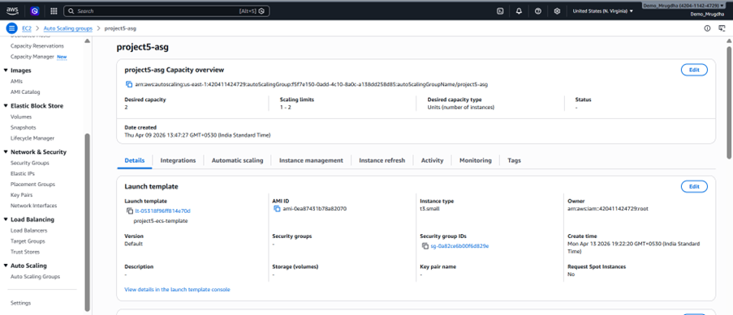

---

### 9. Launch Template

- Defines EC2 instance configuration for ECS cluster
- Includes:
  - AMI
  - Instance type
  - Security groups

 **Launch Template**

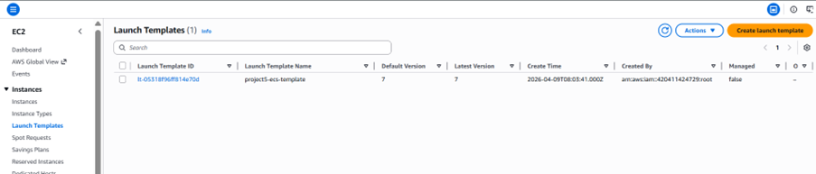

---

### 10. IAM Roles

- Provides secure access between AWS services
- Used for:
  - ECS tasks
  - EC2 instances
  - Service permissions

 **IAM Roles**

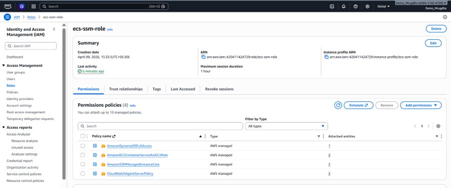

---

### 11. Security Groups

- Acts as a virtual firewall for:
  - EC2 instances
  - Load balancer

- Controls inbound and outbound traffic

 **Security Groups**

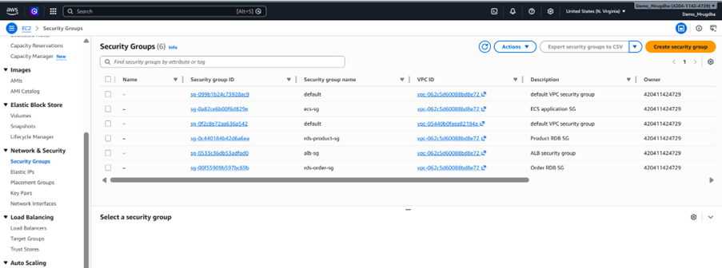

---

### 12. Target Groups

- Used by ALB to route traffic to ECS tasks
- Performs:
  - Health checks
  - Load distribution

 **Target Group**

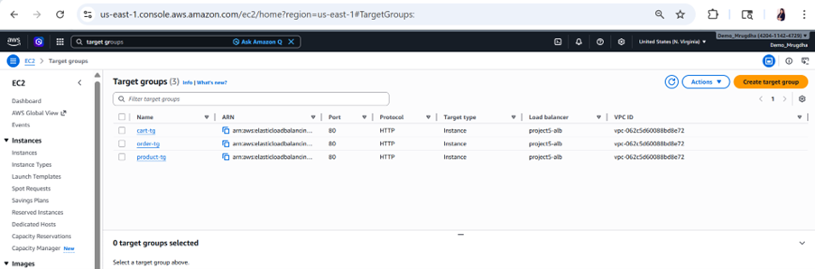

---

### Key Takeaway

This project demonstrates how multiple AWS services work together to build a:

- Scalable system
- Fault-tolerant architecture
- Real-world microservices application

---

## VPC, Networking & Security Architecture

A strong cloud architecture is not just about services — it is built on a well-designed **networking foundation**.

In this project, a custom **Virtual Private Cloud (VPC)** is created to isolate and securely manage all AWS resources.

---

### 1. Virtual Private Cloud (VPC)

- A VPC is a logically isolated network within AWS
- All resources (ECS, EC2, RDS, etc.) are deployed inside this VPC

- Benefits:
  - Network isolation
  - Security control
  - Custom IP address range

---

### 2. Subnets (Public & Private Design)

The VPC is divided into multiple subnets:

- **Public Subnets**
  - Used for:
    - Application Load Balancer (ALB)
  - Accessible from the internet

- **Private Subnets**
  - Used for:
    - ECS services (containers)
    - Databases (RDS, DynamoDB access)
  - Not directly exposed to the internet

---

### 3. Route Tables

- Route tables control how traffic flows within the VPC

- Public subnet route:
  - Connected to **Internet Gateway**
  - Allows external access (for ALB)

- Private subnet route:
  - No direct internet exposure
  - Ensures backend services remain secure

---

### 4. Internet Gateway

- Enables communication between:
  - VPC resources
  - Internet

- Attached to the VPC
- Used by public subnets

---

### 5. Security Groups (Firewall Layer)

- Security Groups act as **virtual firewalls**

- Configured for:
  - ALB → allow HTTP traffic (port 80)
  - ECS → allow traffic only from ALB
  - RDS → allow traffic only from ECS

- This ensures:
  - No direct public access to backend or database
  - Controlled and secure communication

---

### 6. Network Design Principle Used

This architecture follows **best practices**:

- Least privilege access
- Layered security
- Separation of concerns
- Public vs Private isolation

---

 **VPC, Subnets & Route Configuration**

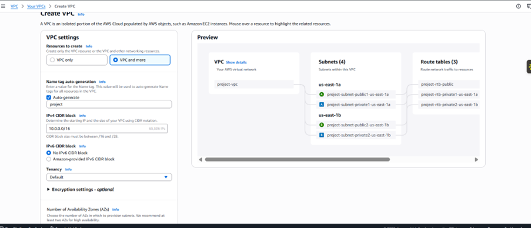

---

### Key Takeaway

- The VPC design ensures:
  - Secure communication between services
  - Controlled internet exposure
  - High availability using multiple subnets

- This is a **production-style networking setup**, even though implemented within Free Tier limits.

---

## Containerization & ECS Deployment

This project uses **Docker and Amazon ECS** to deploy backend services as containers.

Each microservice (Product, Cart, Order) is:
- Packaged into a Docker image
- Stored in Amazon ECR
- Deployed as ECS services

---

### 1. Docker Containerization

- Each service has its own **Dockerfile**
- Containers include:
  - Application code
  - Dependencies
  - Runtime environment

- Frontend is served using **Nginx**
  - Since it is a static website (HTML, CSS, JS)
  - Lightweight and efficient

---

### 2. ECS Task Definition

- Defines how containers run:
  - CPU & memory allocation
  - Port mappings
  - Docker image from ECR

 **ECS Task Definition**

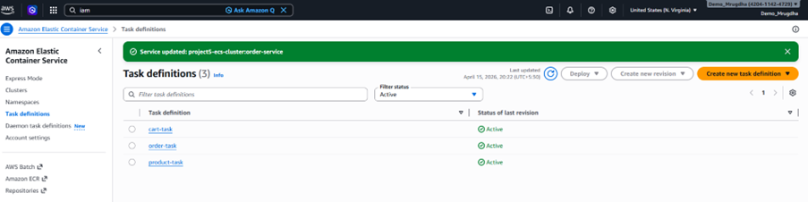

---

### 3. ECS Services

- Each microservice runs as an ECS Service
- Ensures:
  - Task is always running
  - Integration with Load Balancer

 **ECS Services**

---

### 4. Why Desired Tasks = 1 (Important)

**Short Answer**  
We kept `desired tasks = 1` during deployment to reduce resource usage and simplify debugging.

**Explanation**
- Auto Scaling Group:
  - desired = 2 (EC2 instances)
  - min = 1
  - max = 2

- This controls **EC2 instances**, NOT containers

So actual setup:
- 2 EC2 instances (across 2 AZs)
- 1 task per service

👉 Meaning:
- Infrastructure is highly available (instance level)
- But only one container is running per service

**Why not 2 tasks?**
- Limited resources (Free Tier constraints)
- Memory issues during deployment
- Easier debugging with a single task
- Enough to validate:
  - ECS placement
  - ALB routing
  - API flow

**Production Recommendation**
- desired tasks = 2+
- One task per AZ/instance
- Ensures true high availability

---

### 5. How Tasks Are Actually Placed

Current setup:
- 2 EC2 instances (t3.small)
- 3 services (product, cart, order)
- Each service → 1 task

👉 Important:
- ECS places tasks based on **CPU and memory availability**
- It does **NOT guarantee equal distribution**

So:
- Multiple tasks may run on the same EC2 instance
- Placement depends on available resources

---

### Key Takeaway

- Docker enables consistent deployments
- ECS manages container lifecycle
- Current setup is optimized for:
  - Learning
  - Testing
  - Resource efficiency

- Can be easily scaled to production by increasing task count

---

## Deployment Testing & Validation

After completing the AWS deployment, multiple real-time tests were performed to validate the **end-to-end functionality** of the system.

These tests confirm that all components — S3, ALB, ECS services, and databases — are working together correctly.

---

### 1. Static Website Access (S3)

- Verified that the frontend is accessible via S3 static website endpoint
- Ensured HTML, CSS, and JS files are loading correctly

 **S3 Static Website Access**

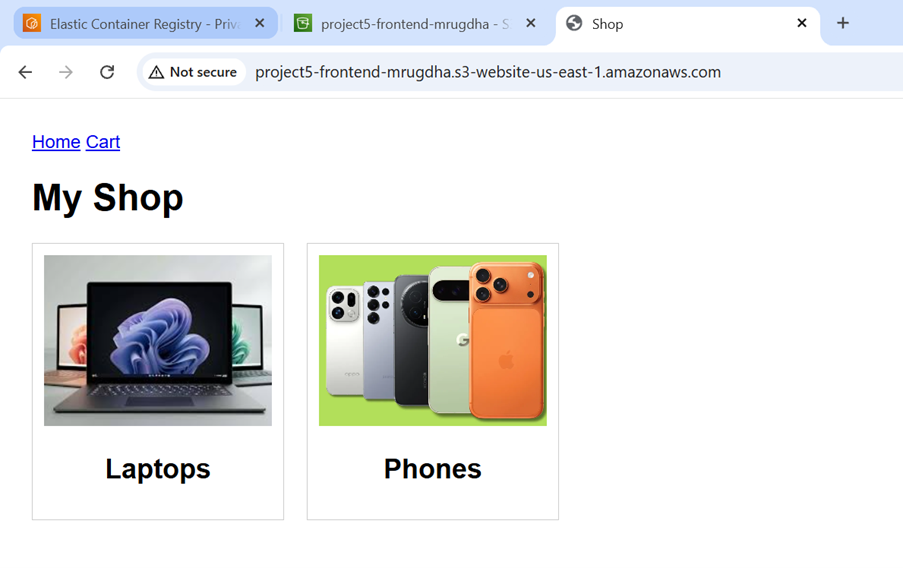

---

### 2. Product Listing via Backend API

- Tested product categories (Laptops & Phones)
- Verified that frontend successfully fetches data from Product Service via ALB

 **Frontend Product Category**

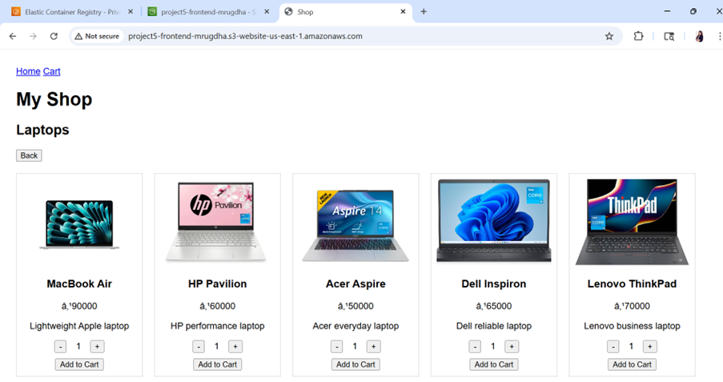

---

### 3. Add to Cart Functionality

- Added products to cart using frontend
- Verified that Cart Service API is working correctly

 **Adding Laptop to Cart**

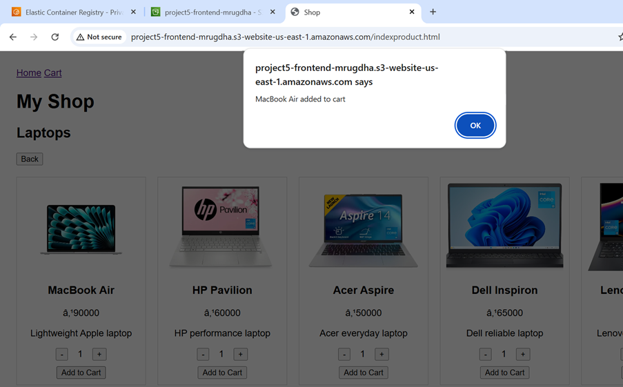

 **Adding Phone to Cart**

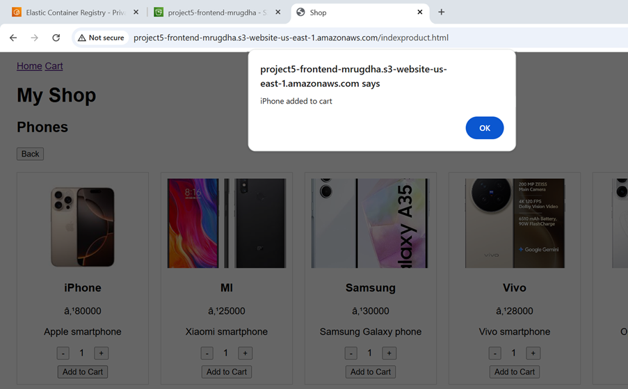

---

### 4. Cart Total Calculation

- Verified that cart correctly calculates:
  - Quantity
  - Total price

 **Cart Items and Total**

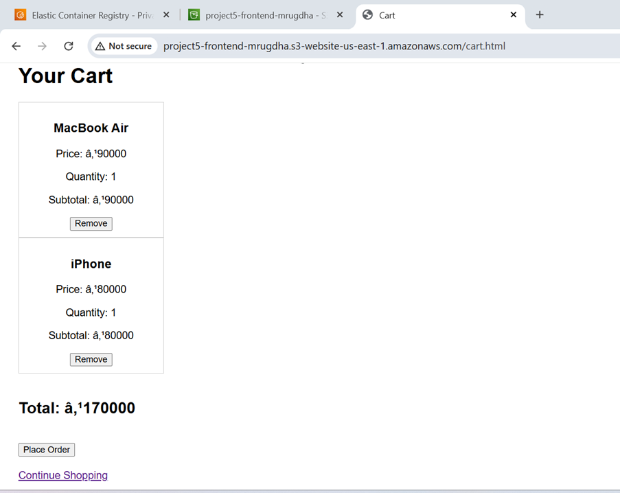

---

### 5. Order Placement Flow

- Clicked **Place Order**
- Verified:
  - Cart data sent to Order Service
  - Order successfully created

 **After Placing Order**

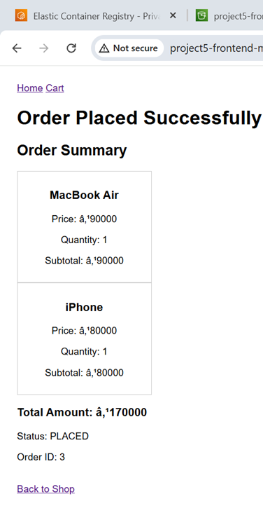

---

### 6. Order Data Retrieved from RDS

- Verified that orders are stored in RDS
- Retrieved order data via ALB endpoint

 **Orders Retrieved from RDS**

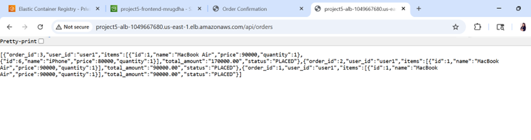

---

### Why Orders Were Verified via ALB

- Amazon RDS does not provide a built-in UI to view table data (rows/columns) in the AWS console  
- Unlike DynamoDB, it does not show data in table format  

Therefore, order data was verified by calling the backend API via the **Application Load Balancer (ALB)**

- This confirms:
  - Data is successfully stored in RDS  
  - Order Service is correctly retrieving and returning data  

---

### Key Outcome

- End-to-end flow is fully functional:
  - Frontend S3 → ALB → ECS Services → Database

- All core features validated:
  - Product browsing
  - Cart operations
  - Order placement
  - Database persistence

- Confirms successful deployment of a **working microservices architecture on AWS**

---

## Errors Faced & Solutions

During deployment and testing, several real-world issues were encountered.  
Resolving these helped in understanding AWS services more deeply.

---

### 1. DynamoDB Access Denied

- **Error:** `AccessDeniedException`
- **Cause:** ECS task role lacked DynamoDB permissions  
- **Solution:**
  - Attached IAM policy: `AmazonDynamoDBFullAccess`
  - Redeployed ECS service  

---

### 2. ECS Deployment Stuck (In Progress)

- **Cause:** New task was failing to start  
- **Solution:**
  - Checked CloudWatch logs  
  - Fixed application errors / missing dependencies  
  - Redeployed service  

---

### 3. RDS Connection Timeout

- **Error:** `ETIMEDOUT`  
- **Cause:** Security group / network misconfiguration  
- **Solution:**
  - Allowed inbound port **3306**
  - Updated security group rules  
  - Ensured ECS and RDS were in same VPC  

---

### 4. S3 Access Denied

- **Cause:** Bucket not publicly accessible  
- **Solution:**
  - Disabled Block Public Access  
  - Added bucket policy (`s3:GetObject`)  

---

### 5. EC2 Not Registering with ECS

- **Cause:** ECS agent not configured in user data  
- **Solution:**
  - Updated launch template script  
  - Installed Docker + ECS agent  
  - Restarted instances  

---

### 6. Docker / ECS Setup Failed (User Data Issue)

- **Cause:** Installation issues in Amazon Linux 2023  
- **Solution:**
  - Fixed user data script  
  - Ensured proper Docker + ECS setup  
  - Refreshed ASG instances  

---

### 7. ECS Task Stuck in PENDING

- **Cause:** Incorrect resource allocation / GPU config  
- **Solution:**
  - Reduced CPU & memory allocation  
  - Removed invalid configurations  

---

### 8. Task Placement Failed (Memory Issue)

- **Cause:** Insufficient memory on `t3.micro`  
- **Solution:**
  - Upgraded to `t3.small`  
  - Performed instance refresh  

---

### 9. ALB 504 Gateway Timeout

- **Cause:** Missing security group rules for dynamic ports  
- **Solution:**
  - Allowed port range **32768–65535** from ALB to ECS  

---

### Key Learning

- Debugging AWS systems requires:
  - Understanding logs (CloudWatch)
  - Correct IAM permissions
  - Proper networking configuration
  - Resource planning (CPU/Memory)

- These issues reflect **real-world deployment challenges**, not just theory.

---

## Conclusion

This project demonstrates the design and deployment of a **microservices-based e-commerce application on AWS** using modern cloud practices.

It highlights:
- End-to-end system design (Frontend → Backend → Database)
- Containerization using Docker
- Deployment using Amazon ECS
- Secure networking with VPC and Security Groups
- Integration of multiple AWS services (S3, ALB, ECS, RDS, DynamoDB)

Despite Free Tier limitations, the architecture reflects **real-world production concepts**, including scalability, fault tolerance, and service isolation.

This project helped strengthen practical understanding of:
- Cloud architecture design
- Debugging distributed systems
- Infrastructure configuration and deployment

---

## Author

**Mrugdha Sankhe**

---
